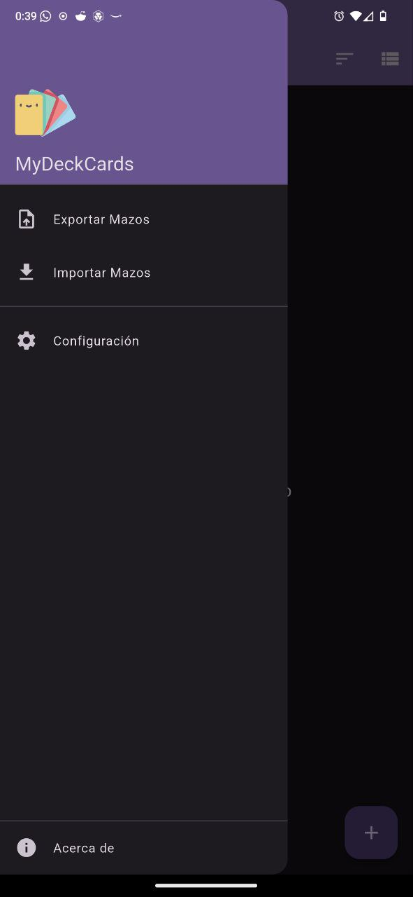
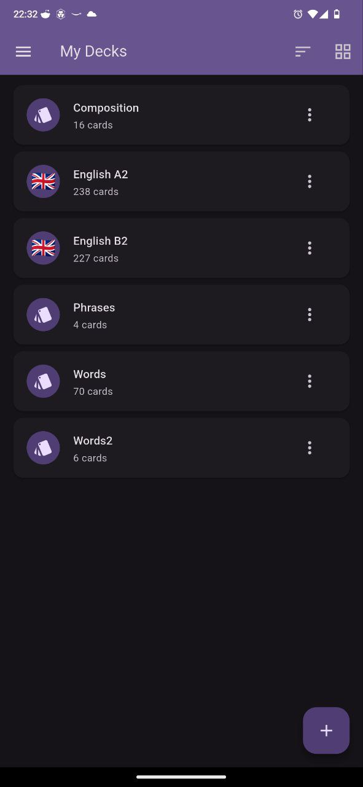
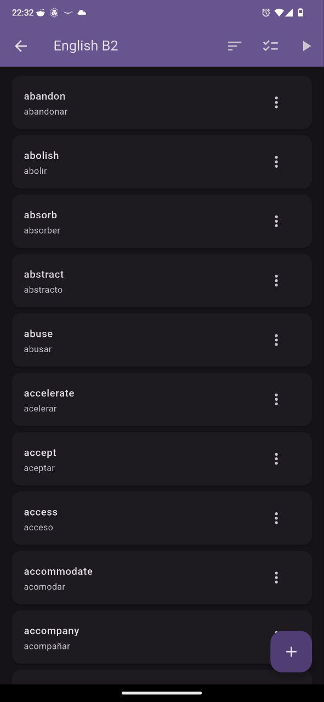
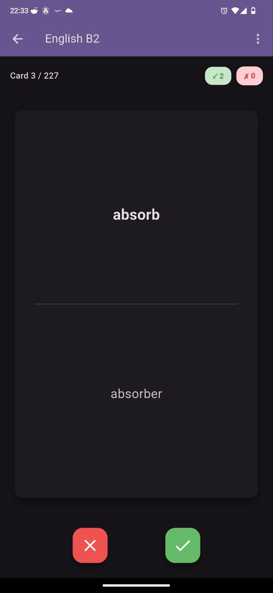

# MyDeckCards

A flashcard application for memorizing vocabulary, developed in Flutter.

<p float="left"> 

 
 
 
</p>

## 📚 Documentation

- **[User Guide](docs/USER_GUIDE.md)**: Complete guide for using the app
- **[Architecture](docs/ARCHITECTURE.md)**: Detailed technical documentation
- **[Contributing](CONTRIBUTING.md)**: Guidelines for contributors
- **[Changelog](CHANGELOG.md)**: Version history and changes

## Features

### Deck Management
- **Create decks**: Create card decks with unique names
- **Rename decks**: Edit the name of existing decks
- **Customize icons**: Assign emoji icons to your decks for easy identification
- **Archive decks**: Move decks to the archive instead of deleting them
- **Restore decks**: Recover archived decks whenever you need them
- **Delete decks**: Remove decks permanently from the archive
- **Predefined decks**: Import pre-made vocabulary decks in English (A1-C1) and Spanish (A1-C1)
- **View card count**: Each deck displays how many cards it contains
- **View modes**: Toggle between grid and list view for displaying decks
- **Sort decks**: Order decks by name (A-Z or Z-A) or creation date (newest or oldest)
- **Quick edit**: Tap any card to edit it directly

### Card Management
- **Add cards**: Add new cards with word (front) and meaning (back)
- **Edit cards**: Modify the content of existing cards
- **Delete cards**: Remove individual cards from a deck
- **Continuous dialog**: After adding a card, the dialog reopens automatically to add more

### Review Mode
- **Interactive visualization**: Tap the card to see the answer (can only be flipped once)
- **Swipe gestures**:
  - Swipe **right** if you know the meaning
  - Swipe **left** if you don't know it
- **Answer buttons**: You can also use the ✓ (correct) and ✗ (incorrect) buttons
- **Progress counter**: See how many cards you got right and wrong
- **Position indicator**: Shows which card you're reviewing (e.g., "Card 3 / 10")
- **Final summary**: When you finish the review, see your total score
- **Repeat option**: Review the deck again without leaving the screen
- **Screen awake**: Keeps the screen on during review (on mobile devices)
- **Exit confirmation**: Shows a confirmation dialog when trying to exit the review

### Import/Export
- **Export decks**: Export all your decks to a JSON file
- **Import decks**: Import decks from a JSON file
- **Conflict resolution**: If an imported deck has the same name as an existing one, it's automatically renamed

### Customization
- **Themes**: Switch between light, dark, or system automatic theme
- **Languages**: Supports English and Spanish, with option to follow system language
- **Drawer navigation**: Access all functions from the side menu
- **About page**: View app information, version, and developer details

## Architecture

The application follows the **MVVM (Model-View-ViewModel)** pattern for clear separation of concerns:

### Architecture Layers:

- **Model**: Data entities (Flashcard, Deck with icon and archive support)
- **View**: Flutter widgets (Views organized by feature) - UI and presentation only
- **ViewModel**: Business logic, validation, and state management
- **Services**: Data access (Database, predefined decks, settings)
- **Providers**: State management and data coordination

### Benefits:
- ✅ **Testability**: Business logic is isolated and can be tested independently
- ✅ **Maintainability**: Changes in logic don't affect UI and vice versa
- ✅ **Separation of concerns**: Each layer has a clear purpose
- ✅ **Reusability**: ViewModels can be reused in different contexts

## Project Structure

```
lib/
├── l10n/
│   └── app_localizations.dart # Internationalization system (i18n)
├── models/
│   ├── flashcard.dart         # Model: Individual card
│   └── deck.dart              # Model: Card deck with icon and archive support
├── viewmodels/
│   ├── base_viewmodel.dart    # Base ViewModel with common functionality
│   ├── home_viewmodel.dart    # ViewModel: Home screen logic
│   ├── deck_detail_viewmodel.dart # ViewModel: Deck detail logic
│   └── review_viewmodel.dart  # ViewModel: Review logic
├── providers/
│   ├── deck_provider.dart     # Provider: Deck and card management
│   └── settings_provider.dart # Provider: Settings, themes, and language
├── views/
│   ├── home/
│   │   ├── home_view.dart     # View: Home screen (UI only)
│   │   ├── archived_decks_view.dart # View: Archived decks screen
│   │   ├── about_view.dart    # View: About screen
│   │   └── widgets/           # Reusable widgets for home views
│   ├── deck_detail/
│   │   ├── deck_detail_view.dart # View: Card screen (UI only)
│   │   └── widgets/           # Reusable widgets for deck detail
│   ├── review/
│   │   ├── review_view.dart   # View: Review screen (UI only)
│   │   └── widgets/           # Reusable widgets for review
│   └── settings/
│       ├── settings_view.dart # View: Settings screen
│       └── widgets/           # Reusable widgets for settings
├── services/
│   ├── database_service.dart  # Service: SQLite database access
│   └── predefined_decks_service.dart # Service: Predefined vocabulary decks
└── main.dart                  # Application entry point
```

## Data Persistence

The application uses **SQLite** (with `sqflite` and `sqflite_common_ffi`) to automatically save all decks and cards locally. Data persists between application sessions and works on all platforms (Android, iOS, Windows, Linux, macOS).

Settings preferences (such as selected theme) are saved with `shared_preferences`.

## Predefined Vocabulary Decks

The application includes pre-made vocabulary decks for language learning, organized by CEFR levels (Common European Framework of Reference for Languages).

### Available Decks

**English** (🇬🇧):
- English A1 (Beginner)
- English A2 (Elementary)
- English B1 (Intermediate)
- English B2 (Upper Intermediate)
- English C1 (Advanced)

**Spanish** (🇪🇸):
- Español A1 (Principiante)
- Español A2 (Elemental)
- Español B1 (Intermedio)
- Español B2 (Intermedio alto)
- Español C1 (Avanzado)
- Español C1 (Avanzado)

### How to Use Predefined Decks

1. Open the drawer menu (☰)
2. Select "Predefined Decks" / "Mazos Predefinidos"
3. Browse available decks by language and level
4. Tap "Import" / "Importar" on the decks you want to add
5. The decks will be added to your collection and can be reviewed immediately

**Note**: Imported predefined decks are fully editable - you can add, edit, or remove cards as needed.

## Archived Decks

Instead of permanently deleting decks, you can archive them to keep your main view organized while preserving the data.

### Archive Features

- **Archive decks**: Move decks to the archive instead of deleting them
- **View archived decks**: Access all archived decks from the drawer menu
- **Restore decks**: Bring archived decks back to your main collection
- **Permanent deletion**: Delete decks permanently only from the archived view
- **Sort archived decks**: Same sorting options as the main view (name, date, card count)

### How to Archive/Restore Decks

**To Archive:**
1. On the home screen, long press a deck
2. Select "Archive" / "Archivar"
3. The deck moves to the archived section

**To Restore:**
1. Open the drawer menu (☰)
2. Select "Archived Decks" / "Mazos Archivados"
3. Long press the deck you want to restore
4. Select "Restore" / "Restaurar"

**To Delete Permanently:**
1. Open "Archived Decks" from the drawer
2. Long press the deck you want to delete permanently
3. Select "Delete Permanently" / "Eliminar Permanentemente"
4. Confirm the action (this cannot be undone)

## Running the Application

```bash
# Install dependencies
flutter pub get

# Run in debug mode
flutter run

# Build for release
flutter build apk  # Android
flutter build ios  # iOS
```

## Dependencies

- **provider**: State management
- **sqflite / sqflite_common_ffi**: Cross-platform SQLite database
- **shared_preferences**: Settings persistence
- **uuid**: Unique identifier generation
- **wakelock_plus**: Keep screen on during review
- **file_picker**: File selection for import
- **path_provider**: System directory access
- **package_info_plus**: Access to app version information
- **flutter_localizations**: Internationalization system
- **intl**: Internationalization utilities

## Usage

1. **Create a deck**: On the home screen, tap the "+" button and enter the deck name
2. **Choose an icon**: Select an emoji icon for your deck (optional)
3. **Use predefined decks**: From the drawer menu, select "Predefined Decks" to import vocabulary decks in English or Spanish (levels A1-C1)
4. **Add cards**: Enter the deck and tap the "+" button to add cards with word and meaning
5. **Review**: Tap the "play" icon in the deck's top bar to start reviewing
6. **Interact with cards**: Tap to flip the card and swipe or use buttons to answer
7. **Sort decks**: Use the sort button (⋮) to organize decks by name or date
8. **Toggle view**: Tap the view mode button to switch between grid and list view
9. **Archive decks**: Long press a deck and select "Archive" to move it out of the main view
10. **Restore decks**: Access "Archived Decks" from the drawer menu to restore or permanently delete decks
11. **Change theme**: Open the side menu (☰) → Settings → Theme
12. **Change language**: Open the side menu (☰) → Settings → Language
13. **Export/Import**: Open the side menu (☰) → Export/Import Decks
14. **About**: View app information from the drawer menu → About

## JSON Export Format

Decks are exported in JSON format with the following structure:

```json
{
  "version": "1.0",
  "exportDate": "2026-01-15T10:30:00.000Z",
  "decks": [
    {
      "name": "Deck Name",
      "icon": "📚",
      "archived": false,
      "cards": [
        {
          "front": "Word or question",
          "back": "Meaning or answer"
        }
      ]
    }
  ]
}
```

### JSON File Fields

- **version** (string): Export format version
- **exportDate** (string): Export date and time in ISO 8601 format
- **decks** (array): List of decks
  - **name** (string): Deck name
  - **icon** (string, optional): Emoji icon for the deck. If not provided, the default icon (📚) will be used
  - **archived** (boolean, optional): Whether the deck is archived. Defaults to false if not provided
  - **cards** (array): List of cards in the deck
    - **front** (string): Front text of the card (question/word)
    - **back** (string): Back text of the card (answer/meaning)

### Import Notes

- When importing, if a deck with the same name exists, it will be automatically renamed by adding a number in parentheses (e.g., "Deck (1)")
- Unique identifiers (IDs) are automatically generated on import
- The file must have a `.json` extension
- The `version` and `exportDate` fields are optional for import, but `decks` is required
- The format is simple and readable; you can create JSON files manually following this structure

### Usage Example

```bash
# Export
1. Open the drawer (side menu)
2. Select "Export Decks"
3. Confirm the export in the dialog
4. Select the folder where to save the file
5. The file will be saved with the name flashcards_export_[timestamp].json

# Import
1. Open the drawer (side menu)
2. Select "Import Decks"
3. Read the dialog information and confirm
4. Select the JSON file to import
5. Review the import summary and confirm
6. Decks will be imported automatically
```

## Internationalization

The application supports multiple languages thanks to the internationalization system (i18n):

### Available Languages
- **English**
- **Spanish** (Español)
- **System** (follows device language)

### How to Change Language
1. Open the side menu (☰)
2. Select "Settings" / "Configuración"
3. Tap "Language" / "Idioma"
4. Select your preferred language

### Adding New Languages

To add support for a new language:

1. Open `lib/l10n/app_localizations.dart`
2. Add translations to the `_localizedValues` map:
   ```dart
   'fr': {  // Language code (e.g., French)
     'appTitle': 'Flashcards',
     'myDecks': 'Mes Paquets',
     // ... more translations
   }
   ```
3. Update the `isSupported` method in `_AppLocalizationsDelegate`:
   ```dart
   bool isSupported(Locale locale) {
     return ['en', 'es', 'fr'].contains(locale.languageCode);
   }
   ```
4. Add the locale in `main.dart`:
   ```dart
   supportedLocales: const [
     Locale('en', ''),
     Locale('es', ''),
     Locale('fr', ''),
   ],
   ```
5. Update `settings_screen.dart` to include the new option in the language selection dialog

## Contributing

We welcome contributions! Please see [CONTRIBUTING.md](CONTRIBUTING.md) for guidelines on:

- Setting up the development environment
- Code style and best practices
- Submitting pull requests
- Reporting issues

## License

Copyright © 2026 SC.

## Support

- **Issues**: Report bugs or request features on [GitHub Issues](#)
- **Discussions**: Join the community discussions
- **Documentation**: Check the [docs](docs/) folder for detailed guides

## Acknowledgments

Built with:
- [Flutter](https://flutter.dev/) - UI framework
- [Provider](https://pub.dev/packages/provider) - State management
- [SQLite](https://www.sqlite.org/) - Local database
- Various other amazing open-source packages (see [Dependencies](#dependencies))

---

Made with ❤️ using Flutter
```
